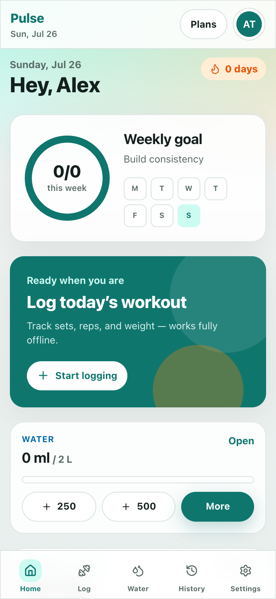
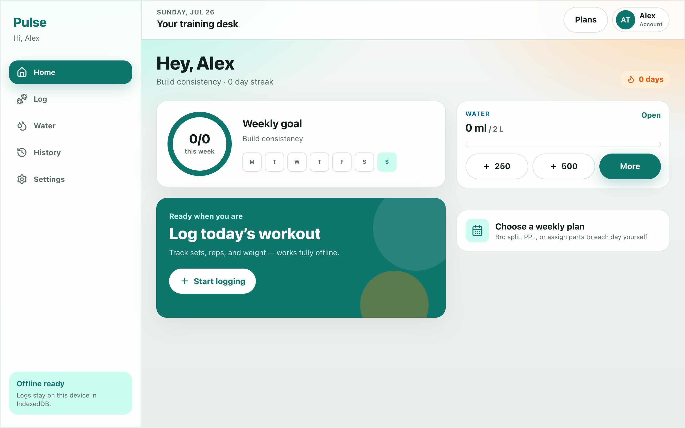
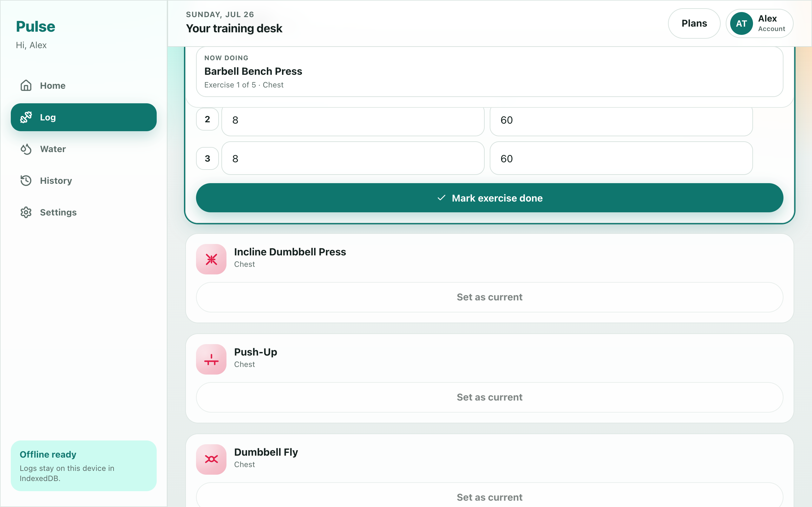
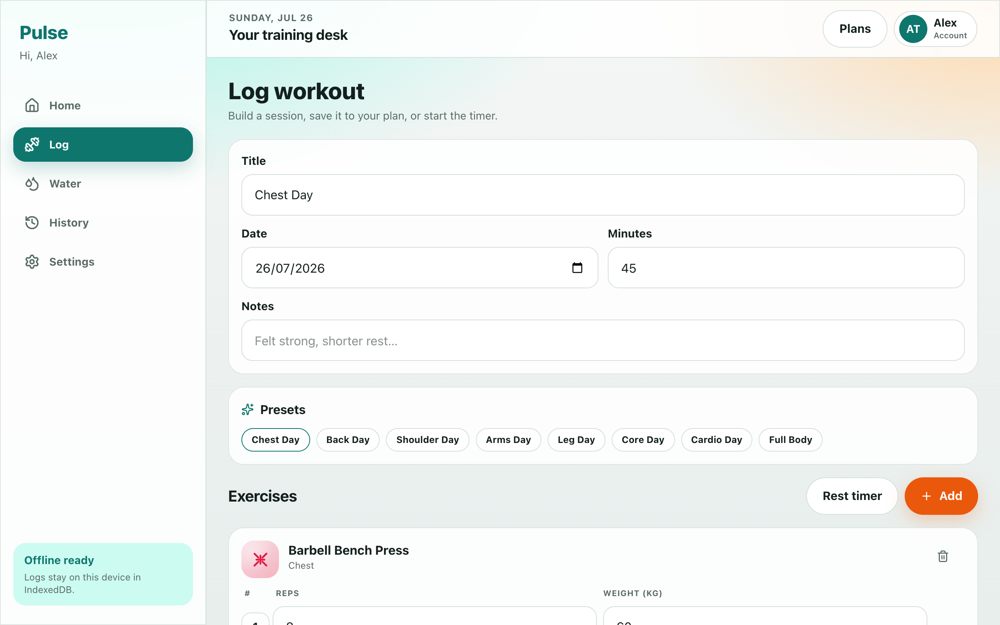
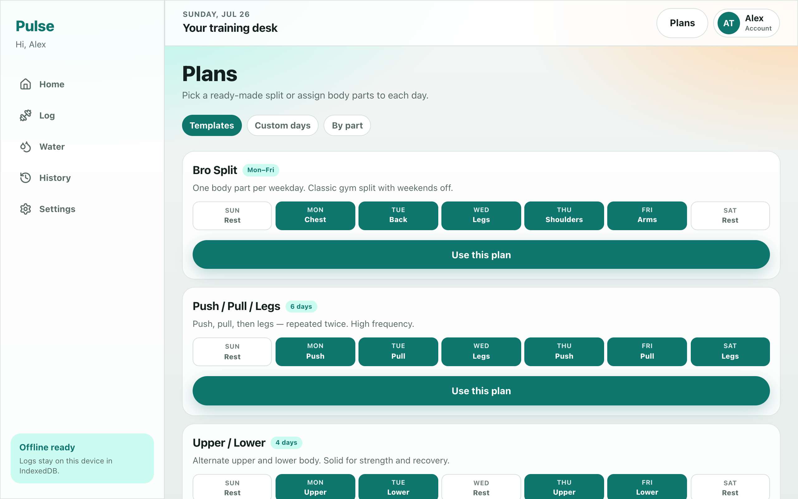
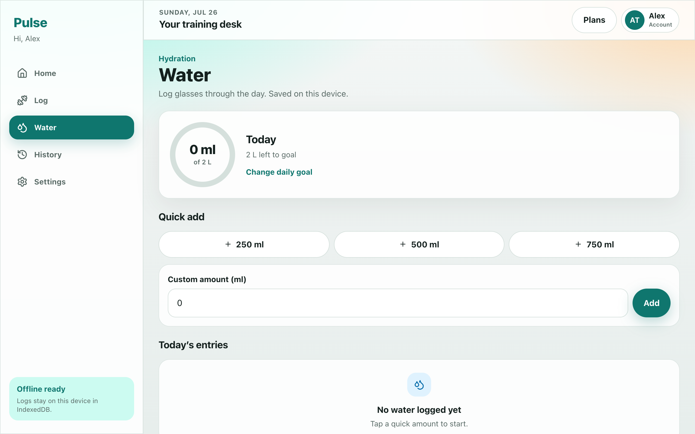
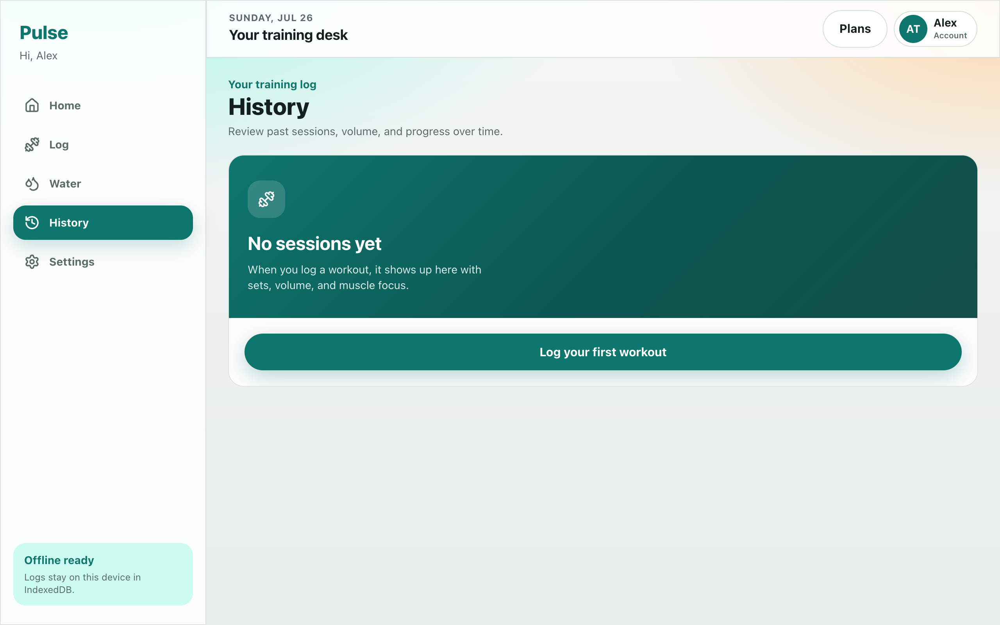
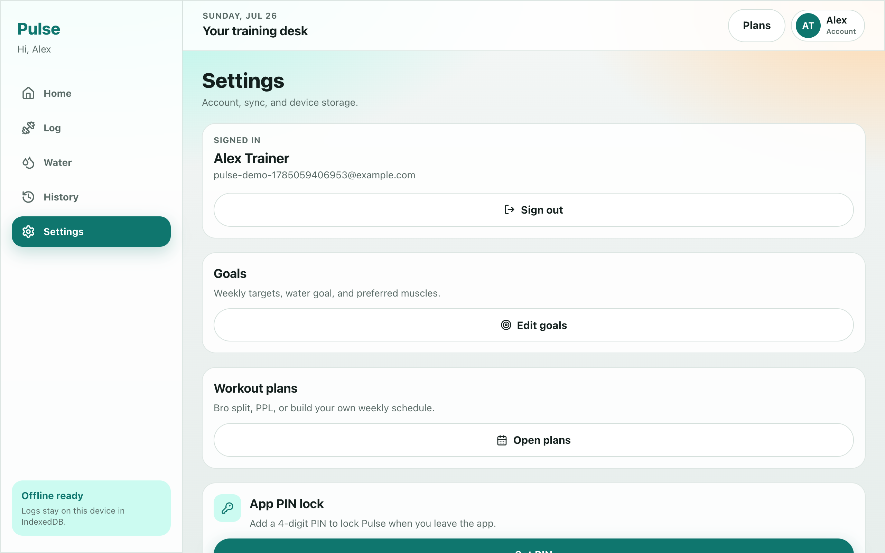
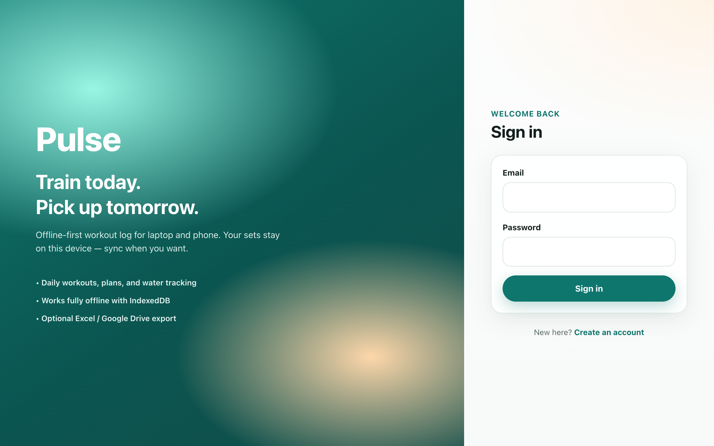

# Pulse — Offline Workout Tracker

Pulse is an offline-first daily workout PWA. Accounts, preferences, goals, plans, water logs, and sessions live in **IndexedDB** on your device. Optional Excel export and Google Drive sync when you’re online.

<p align="center">
  
  &nbsp;
  
</p>

## Screenshots

| Dashboard | Active session |
| --- | --- |
|  |  |

| Log / build workout | Weekly plans |
| --- | --- |
|  |  |

| Water | History |
| --- | --- |
|  |  |

| Settings & PIN | Sign in |
| --- | --- |
|  |  |

## Features

### Accounts & security
- Local sign-up / sign-in (password hashed with salt; session in `localStorage`)
- Optional **4-digit PIN lock** — prompts whenever the app returns from the background
- Sign out from the profile menu

### Onboarding & goals
- First-run setup for units (kg / lbs), weekly days, daily minutes, focus, preferred muscles
- Goals page for weekly workouts, daily minutes, water target, weight targets
- Streak tracking on the dashboard

### Dashboard
- Weekly progress ring and day-of-week consistency dots
- Quick water logging (+250 / +500 ml)
- Today’s plan preview and “start logging” CTA
- Recent sessions shortcut
- Responsive layout: bottom nav on mobile, sidebar on laptop

### Workout plans
- Templates: Bro Split, Push/Pull/Legs, Upper/Lower, Full Body
- Custom week builder (assign muscles per day)
- Body-part shortcuts that open a prefilled log
- **Save to plan** from the log screen updates that weekday’s exercises

### Log & live session
- Build a session with title, date, minutes, notes
- **Presets** from today’s plan or body-part templates (editable)
- Exercise picker with recent exercises first
- Reasonable default reps / weight / sets per exercise
- **Start workout** — compact stopwatch with pause, progress line, and “now doing”
- Mark each exercise done → focus moves to the next
- **Set as current** to pick the next exercise when nothing is in progress
- Mandatory **1-minute rest** between exercises (session timer keeps running)
- Rest timer for sets while building (before a session starts)
- One logged session per calendar day
- Auto wrap-up prompt after target time + 10 minutes; auto-completes ~20 minutes later if ignored

### History
- Searchable session list (title / exercise)
- Filters and session detail (sets, volume, duration)
- Clear training data / CSV export from profile & settings

### Water
- Daily intake with quick adds and custom amounts
- Progress against your daily water goal

### Offline & PWA
- Installable PWA (Add to Home Screen)
- Service worker caching with **auto-update** when a new build is deployed
- Works offline for logging; sync/export when online

### Export & sync
- Download workouts as Excel (`.xlsx`)
- Optional Google Drive sync (`pulse-workouts.xlsx`)
- CSV export of training data

## Tech stack

- Vite + React + TypeScript
- Tailwind CSS v4
- Dexie (IndexedDB)
- `vite-plugin-pwa` (Workbox)

## Run locally

```bash
npm install
npm run dev
```

Open the URL Vite prints (usually `http://localhost:5173`).

### Production preview

```bash
npm run build
npm run preview -- --host
```

## Install as a PWA

Browsers only offer install on **HTTPS** or **localhost**.

### iPhone / iPad (Safari)

1. Open Pulse in **Safari**
2. Tap **Share** → **Add to Home Screen**
3. Name it **Pulse** → **Add**

### Android (Chrome)

1. Open Pulse in Chrome
2. Menu → **Install app** or **Add to Home Screen**

### Desktop (Chrome / Edge)

1. Open Pulse
2. Use the install icon in the address bar, or menu → **Install Pulse…**

### Getting updates on a phone

Pulse does not push updates. After you deploy a new build to the same URL:

1. Open the home-screen app while online
2. Fully close it and open again so the new service worker can activate

If the UI stays stale, open the URL once in Safari, or clear that site’s website data and re-add to the home screen. Icons are often cached at install time.

## Google Drive sync (optional)

1. Create a project in [Google Cloud Console](https://console.cloud.google.com/)
2. Enable **Google Drive API**
3. Create an **OAuth 2.0 Client ID** (Web application)
4. Add your app origin to Authorized JavaScript origins
5. Paste the Client ID in **Settings → Google OAuth Client ID**
6. Tap **Sync to Google Drive**

## Regenerating screenshots

With the dev server running (`npm run dev`):

```bash
npm i -D playwright@1.51.0
npx playwright install chromium
node scripts/capture-screenshots.mjs
```

Images are written to `docs/screenshots/`.
